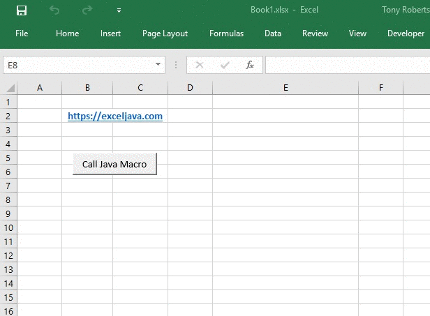

[](https://jitpack.io/#exceljava/jinx-com4j)
[](https://ci.appveyor.com/project/TonyRoberts/jinx-com4j)

# jinx-com4j
Excel COM bindings for use with Jinx.

Jinx allows you to write Excel macros in Java, Scala and Kotlin, as well as user defined (worksheet) functions and menus.
This project provides wrappers for the Excel object model so that Excel can be called from Java in the same way as it is from VBA.
This enables writing VBA-style macros and menus for Excel in Java and other JVM languages.

For more information about Jinx see https://exceljava.com.



## Examples

Some examples are provided in the examples folder.

Build the example project using maven:

```cmd
mvn package
```

And then add the output folder from the examples project to your jinx.ini file.

```ini
[JAVA]
classpath =
    c:/github/exceljava.com/jinx-com4j/examples/target/*.jar
```

The maven project copies all dependencies to the target folder, and the classes to load are embedded in a resource in the built examples jar.

Start Excel and add the Jinx Add-In if you haven't done so already. Now when you open the included examples workbook you can test out the macros and menu function.

## Using jinx-com4j in your own project

Use use jinx-com4j in your own project you need to reference the jinx-com4j jar, which is available from [jitpack.io](https://jitpack.io/#exceljava/jinx-com4j).

To add it as a dependency to your own project add the following to your pom.xml

```xml
<repositories>
  <repository>
      <id>jitpack.io</id>
      <url>https://jitpack.io</url>
  </repository>
</repositories>

<dependency>
    <groupId>com.github.exceljava.jinx-com4j</groupId>
    <artifactId>jinx-com4j</artifactId>
    <version>1.0.0</version>
</dependency>
```

For other build systems see [jitpack.io](https://jitpack.io/#exceljava/jinx-com4j).

## Notes

This project uses a [fork of com4j](https://github.com/exceljava/com4j). There were some changes necessary to com4j to make it work nicely with Excel, and those changes are (at the time of writing) outstanding pull requests on the parent repo. Once they have been accepted it is expected that this project will use the parent com4j repo and the fork will no longer be necessary.

Using another version of com4j not from the exceljava fork is likely to cause Excel to crash.

The Excel object model wrapper classes in the com.exceljava.com4j package are auto-generated, but have been checked in so that this project can be built on systems that don't have Excel installed. To rebuild them using the tlbimp tool from the fork of the com4j project as follows:

```cmd
 java -jar tlbimp.jar \
          -o "C:/github/exceljava/jinx-com4j/jinx-com4j/src/main/java/" \
          -p "com.exceljava.com4j" \
          -addLibNameToPackageName \
          -generateDefaultMethodOverloads \
          -javaGetterSetterName \
          -defaultLcid 1033 \
          "C:\Program Files\Microsoft Office\Root\Office16\EXCEL.EXE"
```
